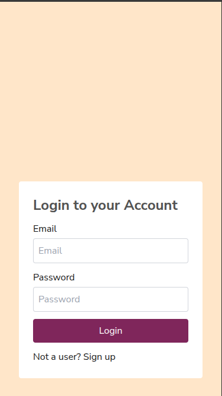
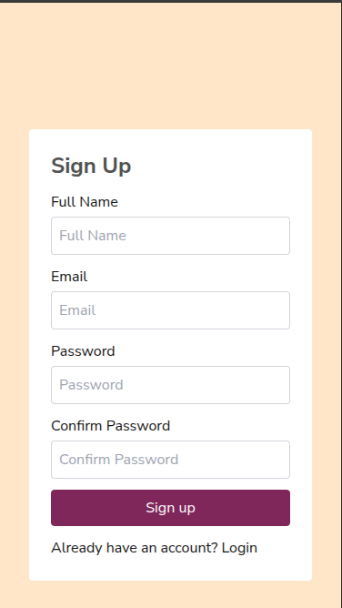
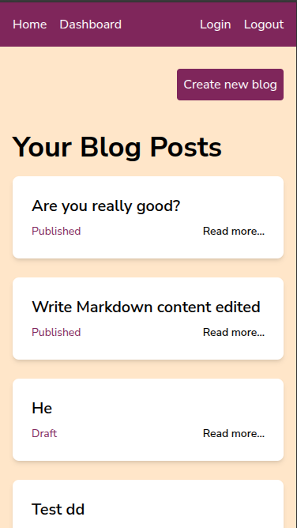
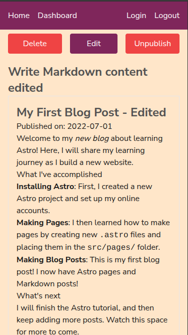
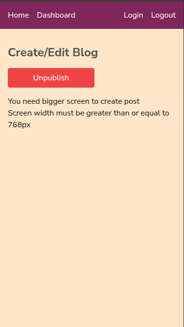
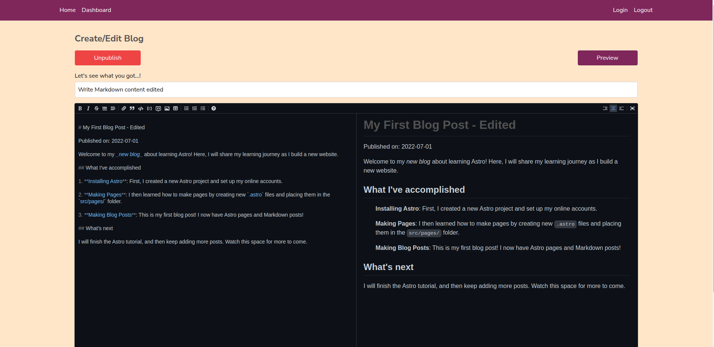
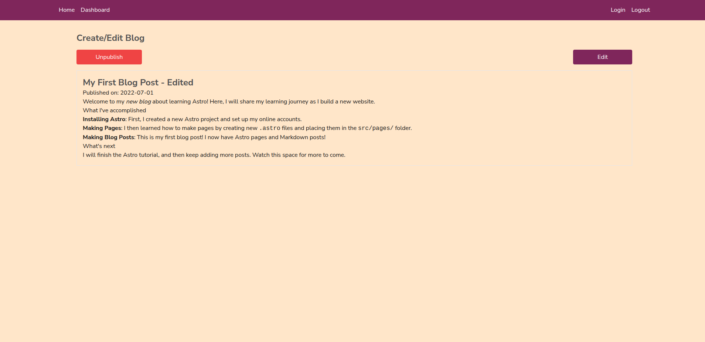

## Getting Started
'main' branch is the updated branch.
- Click on the live dome URL.
- Starting by signing up

## Installation
```bash
npm run dev
# or
yarn && yarn dev
```

## Live demo
[Live Demo](https://blog-saas-topaz.vercel.app/)

## Techs Used
- Next.js app router
- JWT, and http only cookie for authentication
- Next.js Error boundary (error.tsx file)
- GraphQL
- Tailwind
- Drizzle
- PostgresSQL
- "react-hook-form" for form validation
- Vercel for deployment
- "react-md-editor" for markdown editor
- "react-markdown" for previewing markdown
- "rehype-sanitize" to md-editor sanitize prevent XSS attacks

## Additional Feature
- Responsive for all screen sized including 4k screens
- Auto-saving for blog
- Draft version
- Count down on delete, for save permanent delete
- Preview feature: to preview the blog while editing/creating blogs.

## Stretch goals met
- Markdown support

## limitation
- No request rate limiting implemented
- Helmet.js has not been implemented for security
- No blog image upload or thumbnail
- Has not use postgresSQL index
- No recover option after delete (usage of soft delete)
- Could have been store blog content as blocks to handle large blogs
- No general home page to view all published blogs irrespective of logged in user.
- Not implemented PostgresSQL transactions to perform rollbacks on API failure.
- ***No Pagination*** (requirement not met)
- ***Logout is just a mock link/button that redirect user to login page. Cookie won't be cleared*** (requirement not met)
- Sitemap and robot.txt not configured
- Not handle JWT refresh token
- Not all components are reusable. However, input, button, and some other components are made reusable.
- Disabled some eslint errors.

## Screenshots








